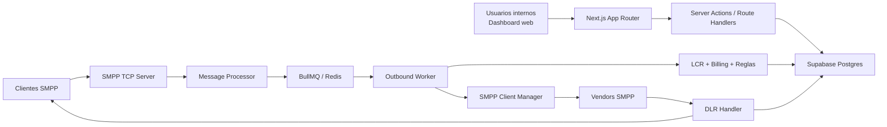

# TelvoiceSMS Platform

## Objetivo del documento

Este documento resume la arquitectura del proyecto y las tecnologias que utiliza, para acelerar el onboarding de personas que se integren al equipo. La idea es explicar como esta construido el sistema hoy, que responsabilidades tiene cada modulo y cuales son los puntos operativos mas importantes.

## Resumen ejecutivo

TelvoiceSMS es una plataforma de mensajeria SMS orientada a operacion carrier/wholesale. Combina dos piezas principales dentro del mismo proceso Node.js:

1. Una aplicacion web en Next.js para administracion, monitoreo, configuracion comercial y operativa.
2. Un motor SMPP propio que recibe trafico de clientes, enruta mensajes hacia vendors, procesa DLRs y actualiza el estado comercial en base de datos.

La persistencia principal vive en Supabase Postgres. Para procesamiento asincrono, el motor usa BullMQ sobre Redis cuando `REDIS_URL` esta disponible. Si Redis no esta disponible, parte del motor entra en modo degradado.

## Arquitectura de alto nivel



## Componentes principales

### 1. Aplicacion web

- Framework: Next.js 16 con App Router.
- Runtime: React 19.
- UI principal en `app/`, `components/` y `components/ui/`.
- La autenticacion se apoya en Supabase Auth.
- La mayoria de las operaciones CRUD y consultas se implementan como Server Actions en `lib/*-actions.ts`.

El dashboard concentra modulos de:

- Clientes, vendors y cuentas SMPP.
- Rate plans, routes, LCR y load distribution.
- Bloqueos, sender IDs, traducciones de contenido y destinos bloqueados.
- Reporteria financiera, retail, wholesale y por vendor.
- Invoices, jobs, DLR management, tools y settings.
- Monitoreo del motor SMPP y sesiones activas.

### 2. Servidor HTTP + motor SMPP en un mismo proceso

El entrypoint real de la aplicacion es `server.ts`, no `next start`.

Ese archivo:

- Levanta el servidor HTTP de Next.js.
- Inicia el `SMPPEngine` en paralelo.
- Maneja apagado ordenado del HTTP server, vendor sessions y workers.

Esto significa que el sistema esta pensado como una sola aplicacion Node.js que expone:

- HTTP para dashboard y APIs.
- TCP SMPP para binds y `submit_sm` de clientes.

### 3. Motor SMPP

El motor vive en `smpp/` y esta dividido por responsabilidades:

- `engine.ts`: orquestador principal.
- `smpp-server.ts`: servidor TCP SMPP para clientes.
- `smpp-client.ts`: conexiones salientes hacia vendors SMPP.
- `session-manager.ts`: estado en memoria de sesiones activas.
- `message-processor.ts`: encola mensajes salientes.
- `queues/`: integracion con BullMQ y workers.
- `lcr-engine.ts`: seleccion de vendor/ruta.
- `billing-engine.ts`: tarificacion, saldo y persistencia de mensajes.
- `dlr-handler.ts`: recepcion y reenvio de delivery receipts.
- `db.ts`: cliente Supabase con service role para el motor.

## Flujo principal de envio SMS

### Flujo inbound desde cliente SMPP

1. Un cliente SMPP hace bind al `SMPPServer`.
2. El servidor valida `system_id`, password, IP whitelist, estado del cliente y limites de conexion en Supabase.
3. Si el bind es valido, la sesion se registra en `SessionManager`.
4. Cuando llega un `submit_sm`, el mensaje se encola via `MessageProcessor`.
5. El cliente recibe ACK SMPP si el mensaje pudo entrar a la cola.

### Flujo outbound hacia vendor

1. `sms-outbound.worker.ts` consume el job desde BullMQ.
2. Resuelve MCC/MNC a partir del destino usando la tabla `mcc_mnc`.
3. Aplica block lists y reglas de traduccion de contenido.
4. Calcula tarifa cliente.
5. Ejecuta LCR o load distribution para elegir vendor.
6. Guarda el mensaje en `messages` con estado `SUBMITTED`.
7. Envia el SMS al vendor mediante `SMPPClientManager`.
8. Actualiza `external_id` con el `message_id` devuelto por el vendor.

### Flujo DLR

1. El vendor envia `deliver_sm`.
2. `DLRHandler` detecta si es DLR o MO.
3. Para DLR, busca el mensaje original en `messages`.
4. Actualiza estado (`DELIVERED`, `FAILED`, etc.).
5. Si corresponde, descuenta saldo del cliente y registra transaccion.
6. Reenvia el DLR a las sesiones SMPP del cliente originador.

## Capas tecnicas

### Presentacion

- Next.js App Router.
- Server Components y Client Components.
- Componentes UI basados en Radix UI.
- Estilos con Tailwind CSS 4.
- Graficos con Recharts.

### Aplicacion

- Server Actions en `lib/` para acceso a datos y logica del dashboard.
- Route Handlers en `app/api/` para operaciones tecnicas y endpoints internos.
- Supabase SSR para autenticacion en entorno web.

### Dominio de negocio

Los dominios mas visibles en el codigo son:

- Gestion de clientes y vendors.
- Provisioning SMPP.
- Routing y pricing.
- Compliance y control de contenido/destino.
- Billing, balances, invoices y reportes.
- Operacion SMPP en tiempo real.

### Infraestructura y mensajeria

- Servidor SMPP construido con la libreria `smpp`.
- Colas asincronas con BullMQ.
- Redis mediante `ioredis`.
- Identificadores UUID para sesiones y mensajes.

## Base de datos

La base principal es Supabase Postgres. Hay dos formas de acceso:

- Cliente SSR/usuario: para dashboard, auth y operaciones sujetas a RLS.
- Cliente service role: para el motor SMPP, que necesita operar del lado servidor sin restricciones de usuario.

### Tablas clave

**Core de usuarios y acceso**

- `profiles`

**Core comercial**

- `customers`
- `vendors`
- `smpp_accounts`
- `rate_plans`
- `rate_plan_rates`
- `routes`
- `lcr_rules`
- `load_distributions`

**Control y compliance**

- `block_lists`
- `sender_ids`
- `content_translations`
- `blocked_destinations`

**Trafico y billing**

- `messages`
- `balance_transactions`
- `invoices`
- `invoice_items`

**Soporte operativo del motor**

- `mcc_mnc`
- `smpp_events`
- `test_messages`
- `repush_dlr_jobs`
- `login_traces`

### Seguridad de datos

- La capa web usa RLS de Supabase.
- El motor SMPP usa `SUPABASE_SERVICE_ROLE_KEY`, por lo que tiene acceso elevado.
- Las tablas principales tienen politicas orientadas a usuarios autenticados y roles `ADMIN`/`MANAGER`.

## Autenticacion y autorizacion

- Autenticacion: Supabase Auth.
- Sesion SSR: `@supabase/ssr`.
- Autorizacion: combinacion de `supabase.auth.getUser()`, tabla `profiles` y chequeos por rol.

Punto importante actual:

- La proteccion del dashboard ocurre principalmente en `app/dashboard/layout.tsx`.
- Los endpoints sensibles, como arranque/parada del motor, vuelven a validar usuario y rol.
- Existe helper en `lib/supabase/middleware.ts`, pero hoy el control visible en runtime depende sobre todo de layouts, actions y route handlers.

## Stack de tecnologias

### Frontend

- Next.js 16
- React 19
- TypeScript 5
- Tailwind CSS 4
- Radix UI
- Lucide React
- Recharts
- React Hook Form
- Zod
- next-themes

### Backend y plataforma

- Node.js
- Next.js Route Handlers
- Next.js Server Actions
- Supabase Auth
- Supabase Postgres
- `@supabase/supabase-js`
- `@supabase/ssr`

### SMPP y procesamiento

- `smpp`
- BullMQ
- Redis
- `ioredis`
- `uuid`

### Observabilidad y utilidades

- Vercel Analytics
- date-fns
- clsx
- class-variance-authority
- tailwind-merge

## Variables de entorno relevantes

Las variables mas importantes que aparecen en el codigo son:

- `NEXT_PUBLIC_SUPABASE_URL`
- `NEXT_PUBLIC_SUPABASE_ANON_KEY`
- `SUPABASE_SERVICE_ROLE_KEY`
- `NEXT_PUBLIC_SITE_URL`
- `NEXT_PUBLIC_DEV_SUPABASE_REDIRECT_URL`
- `REDIS_URL`
- `HOST`
- `PORT`
- `SMPP_PORT`
- `NODE_ENV`

## Modos de operacion

### Modo normal

- Dashboard web disponible.
- Motor SMPP levantado.
- Redis disponible.
- Workers activos.
- Vendors conectados segun configuracion.

### Modo degradado

Si Redis no esta disponible:

- El dashboard puede seguir funcionando.
- El proceso HTTP puede seguir arriba.
- El motor puede iniciar parcialmente.
- Los workers BullMQ se deshabilitan.
- El encolado de mensajes outbound falla, por lo que no hay procesamiento normal de `submit_sm`.

## Estructura del repositorio

```text
app/                    Rutas y paginas Next.js
app/api/                Endpoints HTTP internos
components/             Componentes de interfaz y formularios
lib/                    Server Actions, tipos y helpers
lib/supabase/           Clientes SSR y helpers de sesion
smpp/                   Motor SMPP y logica de trafico
smpp/queues/            Colas y workers BullMQ
scripts/                SQL y utilidades operativas
public/                 Assets estaticos
server.ts               Proceso principal HTTP + SMPP
```

## Decisiones arquitectonicas importantes

### Monolito operativo

La aplicacion no esta separada en microservicios. Dashboard, APIs y motor SMPP conviven en el mismo proceso. Esto simplifica despliegue y comparticion de contexto, pero implica que:

- un reinicio afecta tanto web como SMPP,
- la capacidad de escalar HTTP y SMPP por separado hoy es limitada,
- el estado de sesiones activas vive en memoria del proceso.

### Estado de sesiones en memoria

`SessionManager` mantiene sesiones de clientes y vendors en memoria. Esto facilita operaciones en tiempo real, pero implica:

- no hay replicacion nativa entre multiples instancias,
- el failover requiere reconexion de sesiones,
- el escalado horizontal del motor no es trivial.

### Base de datos como fuente de verdad

Aunque las sesiones viven en memoria, la configuracion operativa y comercial vive en Supabase:

- cuentas SMPP,
- vendors,
- reglas LCR,
- pricing,
- balances,
- mensajes,
- invoices y reportes.

## Riesgos y puntos a tener presentes

- El motor depende fuertemente de Supabase y Redis para el flujo completo de mensajeria.
- El estado de sesiones no esta externalizado.
- Parte de la logica del negocio vive distribuida entre Server Actions del dashboard y el motor SMPP.
- El mismo proceso concentra responsabilidades web, TCP, colas y billing.
- Hay varias areas funcionales ya presentes en UI que parecen en diferentes niveles de madurez funcional, por lo que conviene validar cada modulo antes de extenderlo.

## Recomendaciones para alguien que se suma al proyecto

1. Empezar por `server.ts` y luego leer `smpp/engine.ts` para entender el ciclo de vida completo.
2. Revisar `app/dashboard/layout.tsx` y `lib/supabase/*` para comprender auth y sesion.
3. Leer `smpp-server.ts`, `sms-outbound.worker.ts`, `smpp-client.ts` y `dlr-handler.ts` en ese orden.
4. Revisar `lib/types.ts` y los scripts SQL para mapear entidades y relaciones.
5. Usar el dashboard de SMPP y los endpoints de `app/api/smpp/*` para observar el sistema en ejecucion.

## Archivos clave para onboarding tecnico

- `server.ts`
- `smpp/engine.ts`
- `smpp/smpp-server.ts`
- `smpp/smpp-client.ts`
- `smpp/queues/sms-outbound.worker.ts`
- `smpp/dlr-handler.ts`
- `smpp/lcr-engine.ts`
- `smpp/billing-engine.ts`
- `app/dashboard/layout.tsx`
- `lib/supabase/server.ts`
- `lib/auth-actions.ts`
- `lib/types.ts`
- `scripts/001_create_schema.sql`
- `scripts/smpp-engine-tables.sql`

## Conclusion

TelvoiceSMS esta construido como una plataforma operacional de SMS con enfoque full-stack: administracion web, logica comercial, routing y motor SMPP comparten la misma base de codigo y la misma base de datos. Para cambios funcionales, casi siempre hay que pensar en dos planos al mismo tiempo:

- el plano administrativo/comercial del dashboard,
- el plano transaccional y en tiempo real del motor SMPP.

Esa dualidad es la clave para entender el proyecto y contribuir con seguridad.
